# Kombucha トラックボールパッド
- [キット内容](#キット内容)
- [組み立て方（はんだ付け）](#組み立て方はんだ付け)
- [動作テスト](#動作テスト)
- [組み立て方（後半）](#組み立て方後半)
- [カスタマイズ](#キーマップの確認変更方法)
- [おまけ](#おまけ)

## キット内容
  
||部品名|数| |
|-|-|-|-|
|1|メインボード|1|黒・PCB|
|2|ミドルプレート1|1|透明・アクリル|
|3|ミドルプレート2|1|透明・アクリル|
|4|ボトムプレート|1|黒・PCB|
|5|保護プレート|1|透明・アクリル|
|6|ネジ（短）|2|3mm|
|7|ネジ（中）|7|4mm|
|8|ネジ（長）|9|6mm|
|9|スペーサー（短）|9|3mm|
|10|スペーサー（長）|7|6mm|
|11|ダイオード|12|1N4148|
|12|リセットスイッチ|1||
|13|ロータリーエンコーダ|1|EVQWGD001|
|14|ゴム足|4||

## キット以外に必要なもの
|部品名|数|||
|-|-|-|-|
|Pro Micro コンスルー付き|1||[遊舎工房様販売ページ](https://shop.yushakobo.jp/products/promicro-spring-pinheader)|
|キースイッチ|11|Kailhロープロファイル（V1, V2)||
|キーキャップ|11|対応するもの||
|7mmオプティカルトラックボールモジュール１uタイプ|1||[遊舎工房様販売ページ](https://shop.yushakobo.jp/products/adtb7m)|
|トラックボールモジュール用レベル変換基板|1||[遊舎工房様販売ページ](https://shop.yushakobo.jp/products/a0800tl-01-1)|
|OLED用ピンヘッダ|1||[遊舎工房様販売ページ](https://shop.yushakobo.jp/products/a1600ph-01-1)|
|OLED用ピンソケット|1|無くても動かせます。|[遊舎工房様販売ページ](https://shop.yushakobo.jp/products/a1600ps-01-1)|
|Micro USB ケーブル|1||
  
## オプション
|部品名|数|||
|-|-|-|-|
|SK6812MINI-E|11|[取り付け方](led.md)|[遊舎工房様販売ページ](https://shop.yushakobo.jp/products/sk6812mini-e-10)|
|WS2812B|6|無くてもバックライトだけ光ります。|[遊舎工房様販売ページ](https://shop.yushakobo.jp/products/a0800ws-01-10)|
|1N4148W|12|表面実装タイプのダイオード|[遊舎工房様販売ページ](https://shop.yushakobo.jp/products/a0800di-02-100)|
 
## 必要な工具
|工具名| |
|-|-|
|はんだごて||
|はんだごて置き場||
|鉛入りはんだ||
|フラックス||
|ピンセット||
|細いドライバー|+の1番ドライバー。|
|ニッパー等ダイオードの足を切れるもの||
|Microsoft Edge、もしくはGoogle Chrome||

## あると便利な工具
|工具名||
|-|-|
|耐熱シリコンマット||
|斜めに切ったタイプのこて先||
|温度調節可能なはんだごて|300度-350度前後。|
|テスター||
|フラックスリムーバー||
|マスキングテープ||
|はんだ吸い取り線||
|耐熱絶縁テープ（カプトンテープ）||

## 組み立て方（はんだ付け）
はんだ付けのやり方は動画で見るとわかりやすいです。  
パーツは思ったより壊れないので落ち着いて作業すると失敗しにくいです。  
 - ホームセンターのDCMさんの解説動画(58秒～)  [YouTube](https://www.youtube.com/watch?v=JFQg_ObITYE&t=58s)
  
それではダイオードをD1からD12まで取り付けます。  
足を曲げて裏から差し込みます。  
ダイオードには向きがあります。三角形の先の棒と黒線を合わせましょう。  
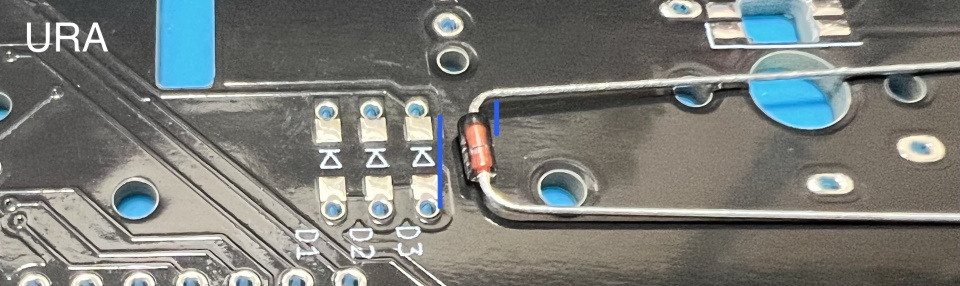  
  
表で更に足を曲げて抜けないようにします。  
ダイオードと並行に曲げるとあとでキースイッチに干渉しにくいです。
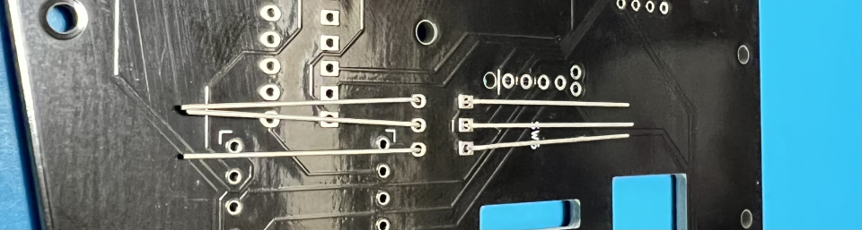  
  
はんだ付けをして足を切ります。  
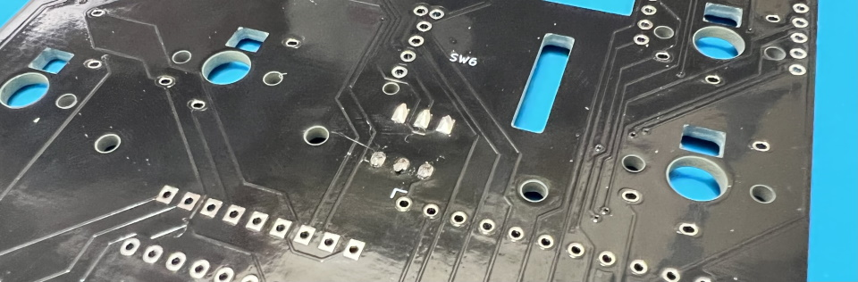  

裏からTB1にOLED用ピンソケットを差し込み、表ではんだ付けします。  
ソケットなしでも動きますがトラックボールを何回も抜き差しする場合はあった方が安心です。  
  

リセットスイッチを表から差し込み裏ではんだ付けします。  
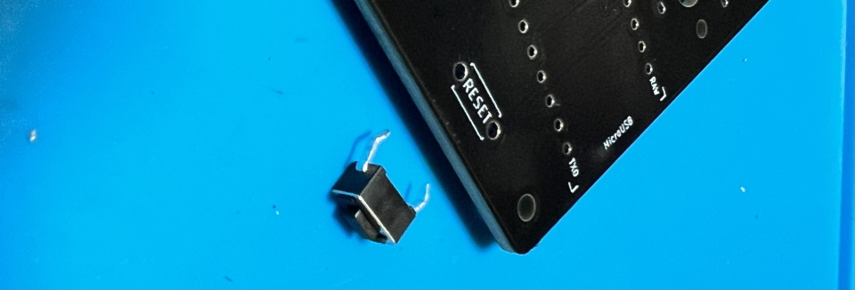   
  
キースイッチを表から差し込みます。  
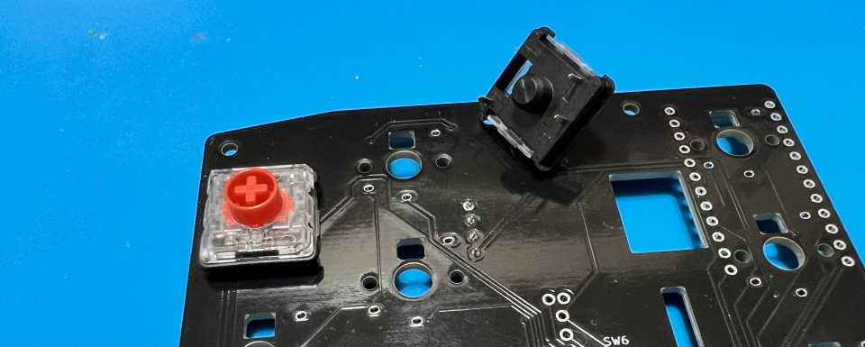  
ここの二つのスイッチはPro Microと接触する可能性があるので、足を切ってからはんだ付けします。
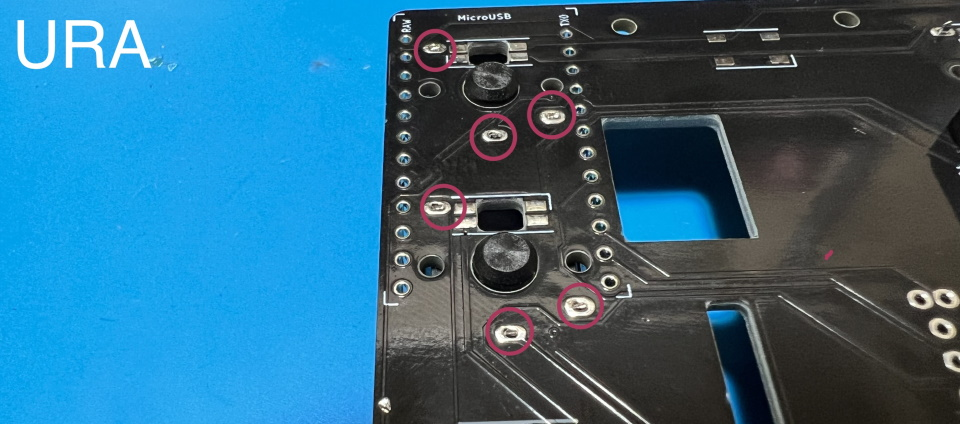  
  
メインボードの裏にコンスルーを挿します。  
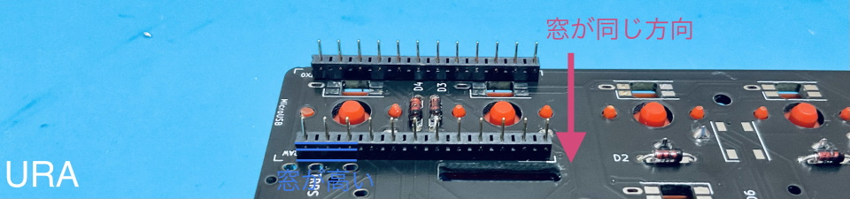  
※新品のPro Microが無かったので別のキットの写真ですが、同様に作っていただいて大丈夫です。  
コンスルーの窓が高くて両方とも同じ向きになるように設置します。  
挿すだけではんだ付けはしません。  
  
コンスルーにPro Microを挿します。TX0, RAW, USBの位置をシルク印刷と合わせましょう。  
カプトンテープをお持ちの方はここでメインボードとPro Microを絶縁しておくと安心です。  
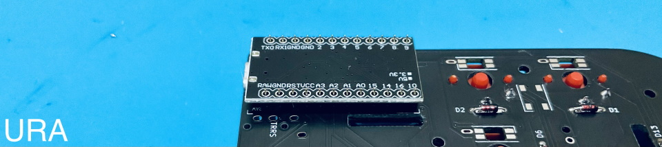   
※新品のPro Microが無かったので別のキットの写真ですが、同様に作っていただいて大丈夫です。
  
Pro Micro側のコンスルーの足を半田付けします。  
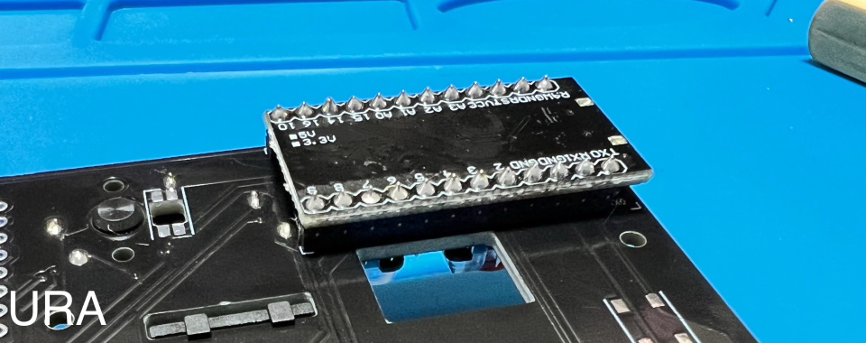   
Pro Microは表面にも取り付けることができます。  
使いやすい方を使ってください。  
  
SW6に表からホイール型のロータリーエンコーダーを取り付けます。  
ピンの位置を確認してツメを穴に差し込みます。  
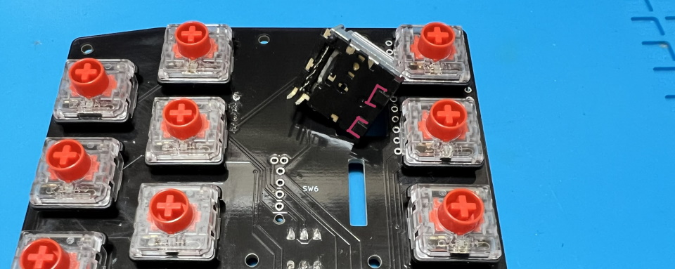  
  
ツメを穴に引っかけてからピンを穴に差し込みます。  
ピンを曲げてしまわないように注意してください。  
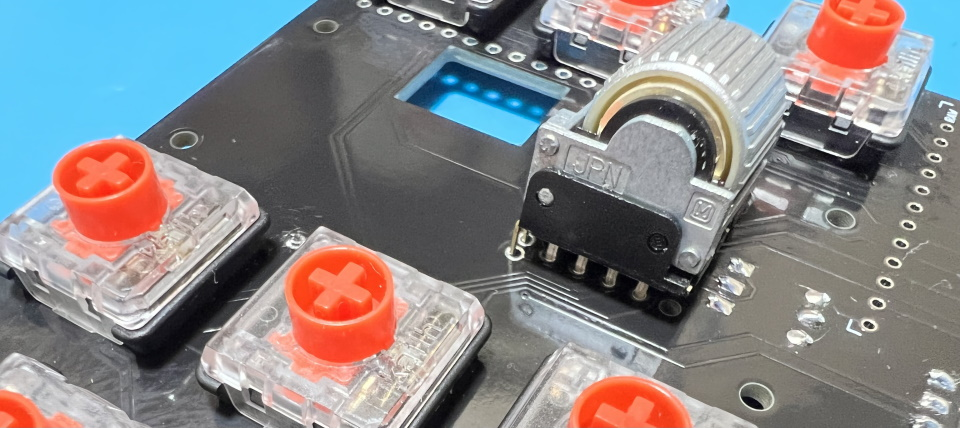  
  
差し込めたらはんだ付けします。  
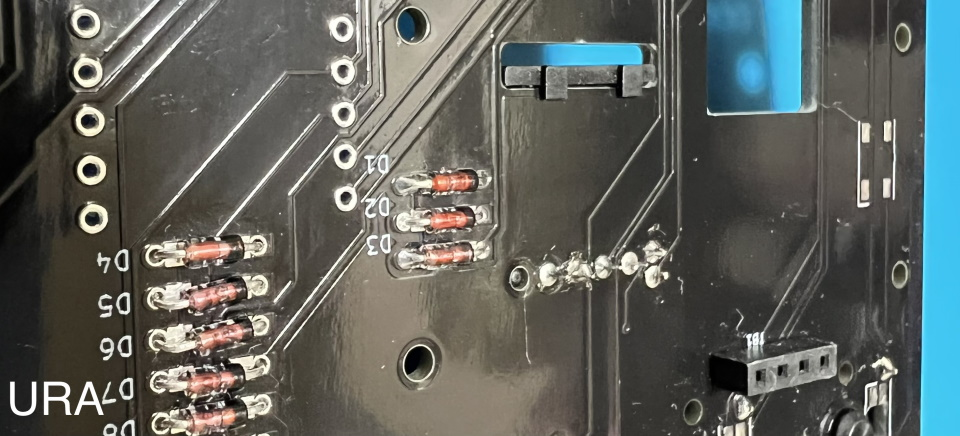  
  
トラックボール、レベル変換基板、OLED用ピンヘッダを画像のようにはんだ付けしましょう。  
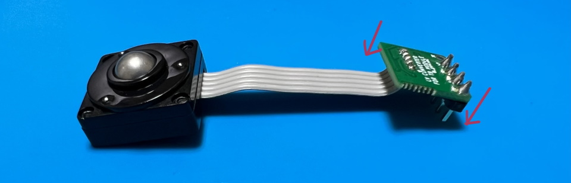  

表からレベル変換基板を通します。  
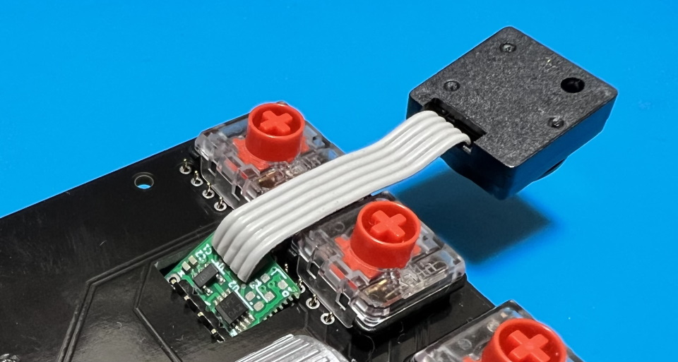  

裏面のピンソケットにピンヘッダを差し込みます。  
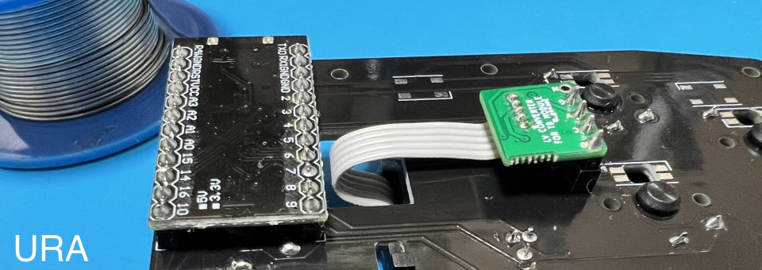  
  
## 動作テスト
Pro Microに動作ソフト（ファームウェア）を書き込んで動作確認をしましょう。  
キットとPCをUSBケーブルでつないでください。   

ファームウェアをダウンロードしてPro Micro Web Updaterにアクセスしてください。
- テスト用ファームウェア [handyman_test.hex](https://github.com/Taro-Hayashi/Handyman/releases/download/14.6/handyman_test.hex)
- Pro Micro Web Updater https://sekigon-gonnoc.github.io/promicro-web-updater/index.html

ファイルの選択ボタンを押してダウンロードしたファームウェアを指定したら、flashボタンを押しましょう。  
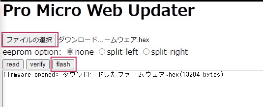  

ブラウザのアドレスバーからメッセージが出てきたら、キットのリセットスイッチを押します。      
すると選択欄にArduino Microが出てきてクリックできるようになります。  
  

選択して接続を押すと書き込みが終わります。  
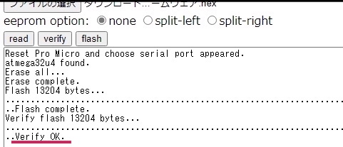  
ファームウェアを更新する時もこの手順で行います。  

アドレスバーやテキストエディタを使ってすべてのスイッチが反応することを確かめてください。
お疲れ様でした。問題がなければはんだ付けは終了です。

## 組み立て方（後半）
USBケーブルを抜いてプレートを組付けます。  
アクリルからは保護フィルムを剥がしてください。割れやすいので気をつけましょう。  

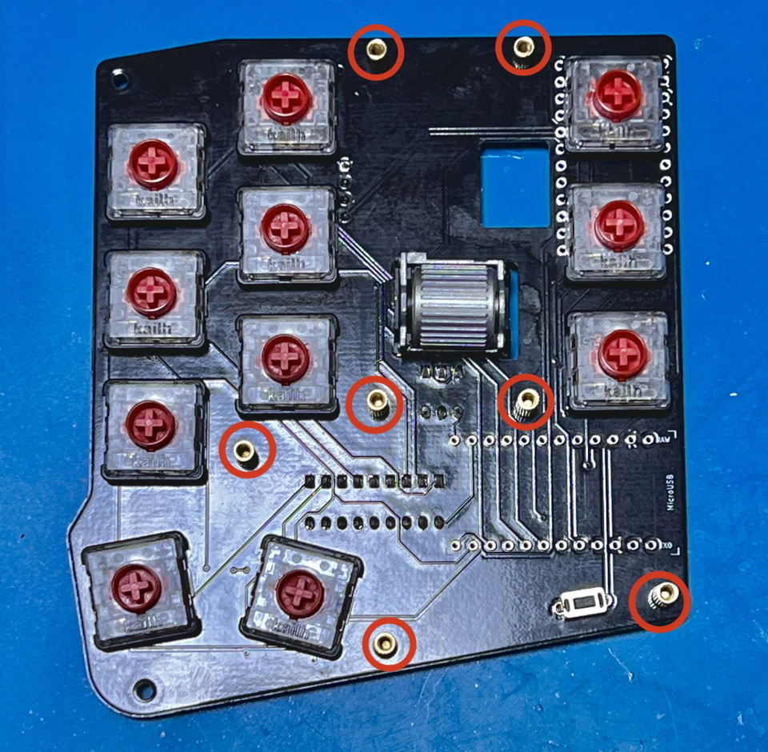  
メインボードの赤丸のネジ穴にスペーサー（中）とスペーサー（短）を止めます。  
画像のようにスイッチがついてる側にスペーサー（中）があるようにしてください。  
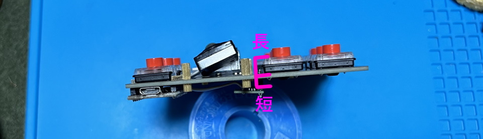  
  
メインボード裏面の残りのネジ穴にスペーサー（短）をネジ（短）で取り付けてミドルプレート1（透明）を嵌めます。
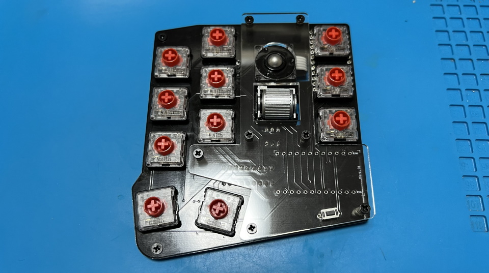  

ミドルプレート2とバックプレートをネジ（長）で止めます。
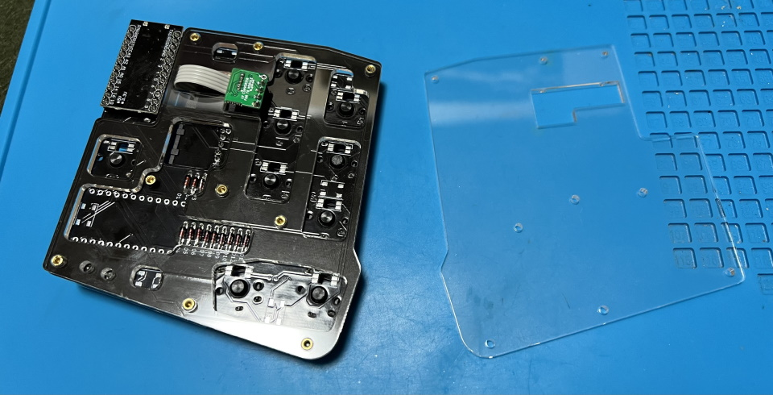  
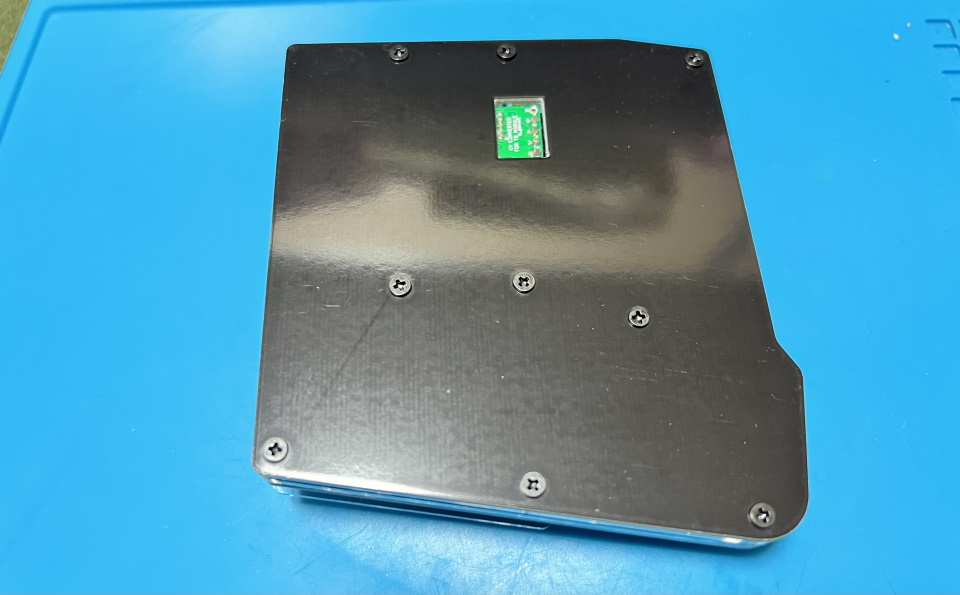  

表に保護プレートをネジ（中）で取り付けましょう。
  

キーキャップを取り付けたら本番用のファームウェアに更新しましょう。
- [handyman_via.hex](https://github.com/Taro-Hayashi/Handyman/releases/download/14.6/handyman_via.hex)

マイナスドライバーでノブを取りつけ、ゴム足を貼ったら完成です。
  
ノブは直径20mmのものまで取り付けを確認しました。  
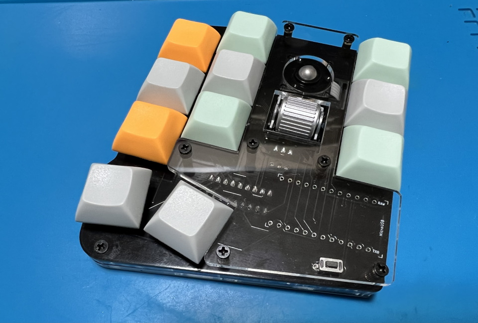  

## キーマップの確認、変更方法
標準ではUS配列設定でのClip Studio Paintにあわせたキーマップになっています。  
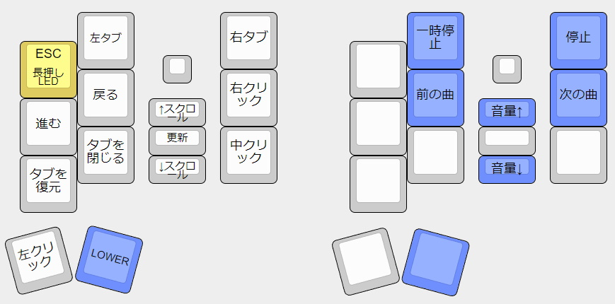  
[Keyboard Layout Editor で見る](http://www.keyboard-layout-editor.com/#/gists/8a9cd944cc1cf5abed875719608a3e3a)  

使わないキーを削除したり使用頻度の高いキーを押しやすい位置に変更してみましょう。  
  
JSONファイルをダウンロードして、ChromeかEdgeでRemapにアクセスしてください。  
- [kombucha.json](https://github.com/Taro-Hayashi/Handyman/releases/download/1.0/kombucha.json)
- Remap https://remap-keys.app/
  
  
左を選んで進んでいき、ダウンロードしたJSONファイルを指定しましょう。
  
ドラッグアンドドロップで変更が終わったら右上のflashボタンを押すと反映されます。  
  
  
## その他

ファームウェアのフォルダ  
https://github.com/Taro-Hayashi/qmk_firmware/tree/master/keyboards/kombucha
  
VIA用JSONファイル [kombucha.json](https://github.com/Taro-Hayashi/Handyman/releases/download/1.0/kombucha.json)  
  
プレートのデザインデータ  
[handyman_plates.zip](https://github.com/Taro-Hayashi/Handyman/releases/download/1.0/kombucha_plates.zip)  
発注先のルールに沿ってデータを修正してください。  
  
ご不明な点があればBOOTHのメッセージかtwitterでいつでも聞いてください。  
BOOTH: https://tarohayashi.booth.pm/items/3208122  
  
foostan様のフットプリントを流用、改変して使わせていただきました。  
https://github.com/foostan/kbd/  
https://github.com/foostan/kbd/blob/master/LICENSE  
  
plut0nium様のフットプリントを流用、改変して使わせていただきました。  
https://github.com/plut0nium/0xLib  
https://github.com/plut0nium/0xLib/blob/master/LICENSE.txt  
  
 この キット は <a rel="license" href="http://creativecommons.org/licenses/by-sa/4.0/">クリエイティブ・コモンズ 表示 - 継承 4.0 国際 ライセンス</a>の下に提供されています。
