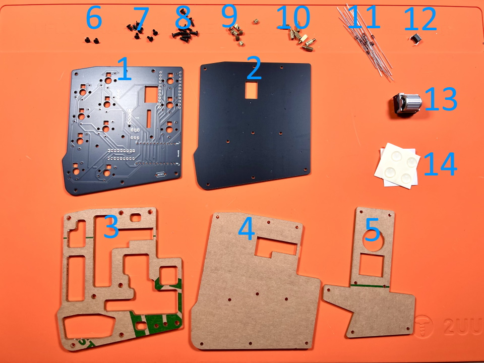
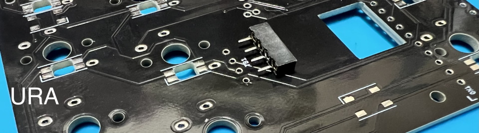
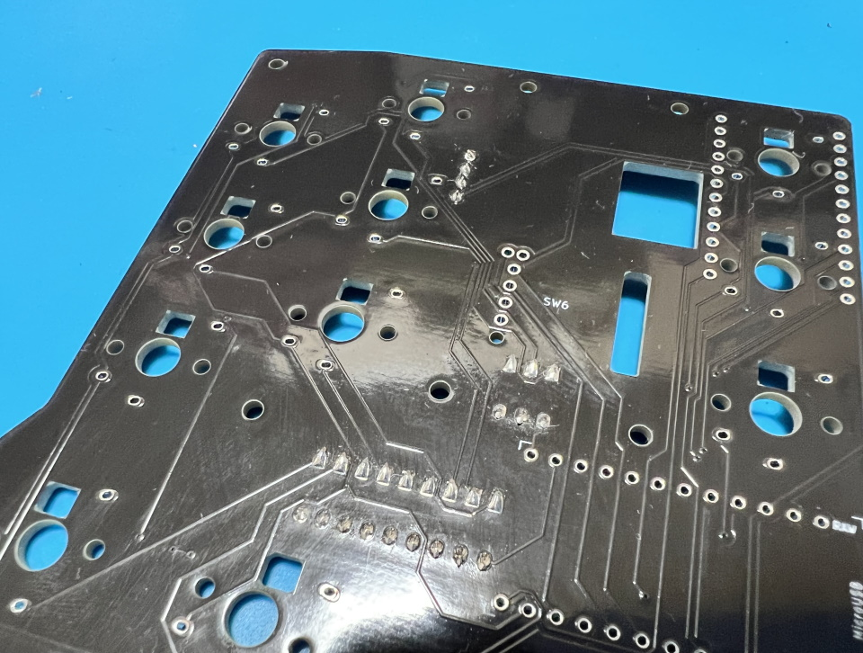

# Kombucha トラックボール
- [キット内容](#キット内容)
- [組み立て方（はんだ付け）](#組み立て方はんだ付け)
- [動作テスト](#動作テスト)
- [組み立て方（後半）](#組み立て方後半)
- [カスタマイズ](#キーマップの確認変更方法)
- [おまけ](#おまけ)

## キット内容
  
||部品名|数| |
|-|-|-|-|
|1|メインボード|1|黒・PCB|
|2|ボトムプレート|1|黒・PCB|
|3|ミドルプレート1|1|透明・アクリル|
|4|ミドルプレート2|1|透明・アクリル|
|5|保護プレート|1|透明・アクリル|
|6|ネジ（短）|2|3mm|
|7|ネジ（中）|7|4mm|
|8|ネジ（長）|9|6mm|
|9|スペーサー（短）|9|3mm|
|10|スペーサー（長）|7|6mm|
|11|ダイオード|12|1N4148|
|12|リセットスイッチ|1||
|13|ロータリーエンコーダ|1|EVQWGD001|
|14|ゴム足|4||

## キット以外に必要なもの
|部品名|数|||
|-|-|-|-|
|Pro Micro|1||[遊舎工房](https://shop.yushakobo.jp/products/promicro)、[コンスルー付き](https://shop.yushakobo.jp/products/promicro-spring-pinheader)、[TALPKEYBOARD](https://talpkeyboard.net/items/5b24504ba6e6ee7ec60063e3)、[Daily Craft Keyboard・コンスルー付き](https://shop.dailycraft.jp/products/promicro_with_conthrou)|
|コンスルー 12ピン（高さ2.5mm）|2|2本必要なのでご注意ください。|[遊舎工房](https://shop.yushakobo.jp/products/31?_pos=1&_sid=ca92edae3&_ss=r&variant=37665714405537)、[TALPKEYBOARD](https://talpkeyboard.net/items/5e056626d790db16e2889233)、[Daily Craft Keyboard](https://shop.dailycraft.jp/products/conthrough)|
|キースイッチ|11|Kailhロープロファイル（V1, V2)|[遊舎工房・V1](https://shop.yushakobo.jp/collections/all-switches/products/pg1350)、[遊舎工房・V2](https://shop.yushakobo.jp/collections/all-switches/products/kailh-choc-v2)、[Daily Craft Keyboard](https://shop.dailycraft.jp/collections/choc-switches)|
|キーキャップ|11||V1は専用のキーキャップ、V2はCherryMXをご用意ください。|
|7mmオプティカルトラックボールモジュール１uタイプ|1||[遊舎工房](https://shop.yushakobo.jp/products/adtb7m)、[ビットトレードワン](https://btoshop.jp/products/adtb7m)、[Amazon](https://www.amazon.co.jp/dp/B087BVNWYS)|
|トラックボールモジュール用レベル変換基板|1||[遊舎工房](https://shop.yushakobo.jp/products/a0800tl-01-1)、[のぎけす屋](https://booth.pm/ja/items/2008258)|
|OLED用ピンヘッダ|1||[遊舎工房](https://shop.yushakobo.jp/products/a1600ph-01-1)|
|OLED用ピンソケット|1||[遊舎工房](https://shop.yushakobo.jp/products/a1600ps-01-1)|
|Micro USB ケーブル|1||[遊舎工房](https://shop.yushakobo.jp/products/usb-cable-micro-b-0-8m)、[TALPKEYBOARD](https://talpkeyboard.net/items/5df82904a551d528d7360c34)、[Daily Craft Keyboard](https://shop.dailycraft.jp/products/usb_cable)|
  
## オプション
|部品名|数|||
|-|-|-|-|
|バックライトLED（SK6812MINI-E）|11|[取り付け方](led.md)|[遊舎工房](https://shop.yushakobo.jp/products/sk6812mini-e-10)、[秋月電子通商](https://akizukidenshi.com/catalog/g/gI-15478/)|
|アンダーグローLED（WS2812B）|6|無くてもバックライトだけ光ります。|[遊舎工房](https://shop.yushakobo.jp/products/a0800ws-01-10)、[秋月電子通商](https://akizukidenshi.com/catalog/g/gI-07915/)|
|表面実装タイプのダイオード（1N4148W）|12||[遊舎工房](https://shop.yushakobo.jp/products/a0800di-02-100)、[Daily Craft Keyboard](https://shop.dailycraft.jp/products/diode_smd)、[秋月電子通商](https://akizukidenshi.com/catalog/g/gI-07084/)|
 
## 必要な工具
100円ショップで売っているもので十分ですが、はんだごては500円商品なので同程度の価格のFX511-01がおすすめです。
|工具名|Amazon|
|-|-|
|はんだごて|[FX511-01](https://amzn.to/3IEGO5w)、[FX600-02](https://amzn.to/3oKNQOg)||
|こて先クリーナー（こて台）|[FH300-81](https://amzn.to/3yuB3CV)、[599B-01](https://amzn.to/3DFsZjD)|
|鉛入りはんだ|[FS407-01](https://amzn.to/31S71fO)|
|精密ドライバー|[TSD-6](https://amzn.to/3dEQvm7)|
|ニッパー等ダイオードの足を切れるもの|[エコー金属 鍛造ニッパー](https://amzn.to/31S75fU)|
|Microsoft Edge、もしくはGoogle Chrome||

## あると便利な工具
|工具名||Amazon|
|-|-|-|
|耐熱シリコンマット||[ノーブランド](https://amzn.to/3rYlcuW)|
|温度調節可能なはんだごて|★|[FX600-02](https://amzn.to/3oKNQOg)||
|斜めに切ったタイプのこて先|★|[FX600用 T18-C2](https://amzn.to/3pGqbNW)|
|フラックス|★|[HAKKO 001-01](https://amzn.to/3dNy4vr)|
|フラックスリムーバー、IPA|★|[GZ901](https://amzn.to/3yeiMtj)|
|ピンセット|★|[ANEX ピンセット No.126](https://amzn.to/3GxKNPp)|
|マスキングテープ|★|[3M マスキングテープ 8巻パック](https://amzn.to/31G4Qwt)|
|テスター||[TDX-200](https://amzn.to/3rXlaDI)|
|はんだ吸い取り線||[FR150-88](https://amzn.to/3pPWWZ5)|
|はんだ吸い取り器||[DS01P](https://amzn.to/31RlusN)|

## 組み立て方（はんだ付け）
はんだ付けのやり方は動画で見るとわかりやすいです。  
パーツは思ったより壊れないので落ち着いて作業すると失敗しにくいです。  
 - ホームセンターのDCMさんの解説動画(58秒～)  [YouTube](https://www.youtube.com/watch?v=JFQg_ObITYE&t=58s)
  
それではダイオードをD1からD12まで取り付けます。  
足を曲げて裏から差し込みます。  
ダイオードには向きがあります。三角形の先の棒と黒線を合わせましょう。  
  
  
表で更に足を曲げて抜けないようにします。  
ダイオードと並行に曲げるとあとでキースイッチに干渉しにくいです。
  
  
はんだ付けをして足を切ります。  
  

裏からTB1にOLED用ピンソケットを差し込み、表ではんだ付けします。  
  
気軽に交換ができなくなりますが、ピンソケットなしではんだ付けしてしまっても構いません。
フラックスクリーナーを使う場合はここで表面を綺麗にしましょう。  
  

リセットスイッチを表から差し込み裏ではんだ付けします。  
   
  
キースイッチを表から差し込みはんだ付けします。  
  
ここの二つのスイッチはPro Microと接触する可能性があるので、足を切ってからはんだ付けします。
  
  
メインボードの裏にコンスルーを挿します。  
  
※新品のPro Microが無かったので別のキットの写真ですが、同様に作っていただいて大丈夫です。  
コンスルーの窓が高くて両方とも同じ向きになるように設置します。  
挿すだけではんだ付けはしません。  
  
コンスルーにPro Microを挿します。TX0, RAW, USBの位置をシルク印刷と合わせましょう。  
カプトンテープをお持ちの方はここでメインボードとPro Microを絶縁しておくと安心です。  
   
※新品のPro Microが無かったので別のキットの写真ですが、同様に作っていただいて大丈夫です。
  
Pro Micro側のコンスルーの足を半田付けします。  
   
Pro Microを設置する場所は表側と裏側に2か所あります。 
使いやすい方を使ってください。  
  
SW6に表からホイール型のロータリーエンコーダーを取り付けます。  
ピンの位置を確認してツメを穴に差し込みます。  
  
  
ツメを穴に引っかけてからピンを穴に差し込みます。  
ピンを曲げてしまわないように注意してください。  
  
  
差し込めたらはんだ付けします。  
  
  
トラックボール、レベル変換基板、OLED用ピンヘッダを画像のようにはんだ付けしましょう。  
  

表からレベル変換基板を通します。  
  

裏面のピンソケットにピンヘッダを差し込みます。  
  
  
## 動作テスト
Pro Microに動作ソフト（ファームウェア）を書き込んで動作確認をしましょう。  
キットとPCをUSBケーブルでつないでください。   

下のwebサイトにアクセスしてください。
- https://remap-keys.app/catalog/08BHJ3OcLCe716TwOdDz/firmware

テストファームウェアを選んでFLASHします。
  
  

キットのリセットスイッチを押すとArduino Microが現れるので、クリックして接続します。
 

書き込みが完了したらウィンドウを閉じて大丈夫です。
 

アドレスバーやテキストエディタを使ってすべてのスイッチが反応することを確かめてください。  
お疲れ様でした。問題がなければはんだ付けは終了です。

## 組み立て方（後半）
USBケーブルを抜いてプレートを組付けます。  
アクリルからは保護フィルムを剥がしてください。割れやすいので気をつけましょう。  

メインボードの赤丸のネジ穴にスペーサー（長）とスペーサー（短）を止めます。 
   
画像のようにスイッチがついてる側にスペーサー（短）があるようにしてください。  
  

トラックボールが円形の穴に綺麗に収まるように保護プレートをネジ（中）で止めます。
  
  
メインボードの残りのネジ穴にスペーサー（短）をネジ（短）で取り付けてミドルプレート1（透明）を嵌めます。
  
トラックボールのケーブルを間に挟んでしまわないように気を付けてください。

ミドルプレート2とバックプレートをネジ（長）で止めます。
  

  

キーキャップを取り付けたら先ほどと同様の手順で本番用のファームウェアに更新しましょう。
- https://remap-keys.app/catalog/08BHJ3OcLCe716TwOdDz/firmware
  

裏面4隅にゴム足を貼ったら完成です。  
  

## キーマップの確認、変更方法
  
[Keyboard Layout Editor で見る](http://www.keyboard-layout-editor.com/#/gists/8a9cd944cc1cf5abed875719608a3e3a)  

使わないキーを削除したり使用頻度の高いキーを押しやすい位置に変更してみましょう。  
  
ChromeかEdgeでRemapにアクセスしてください。  
- Remap https://remap-keys.app/
  
  
左を選ぶとキーボードを選択できます。  
  
ドラッグアンドドロップで変更が終わったら右上のflashボタンを押すと反映されます。  
  
  
## その他

ファームウェアのフォルダ  
https://github.com/Taro-Hayashi/qmk_firmware/tree/master/keyboards/kombucha
  
VIA用JSONファイル [kombucha.json](https://github.com/Taro-Hayashi/Kombucha/releases/download/14.15/kombucha.json)  
  
プレートのデザインデータ  
[kombucha_plates.zip](https://github.com/Taro-Hayashi/Kombucha/releases/download/14.31/kombucha_plates.zip)  
発注先のルールに沿ってデータを修正してください。  
  
ご不明な点があればBOOTHのメッセージかtwitterでいつでも聞いてください。  
  
foostan様のフットプリントを流用、改変して使わせていただきました。  
https://github.com/foostan/kbd/  
https://github.com/foostan/kbd/blob/master/LICENSE  
  
plut0nium様のフットプリントを流用、改変して使わせていただきました。  
https://github.com/plut0nium/0xLib  
https://github.com/plut0nium/0xLib/blob/master/LICENSE.txt  
  
 この キット は <a rel="license" href="http://creativecommons.org/licenses/by-sa/4.0/">クリエイティブ・コモンズ 表示 - 継承 4.0 国際 ライセンス</a>の下に提供されています。

- BOOTH: https://tarohayashi.booth.pm/items/3252673  
