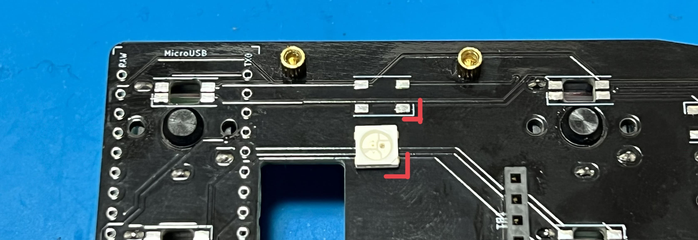
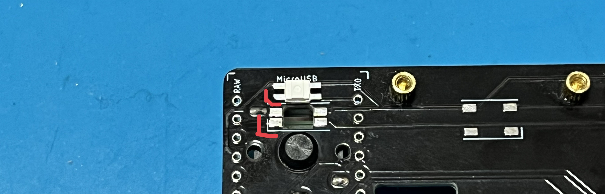
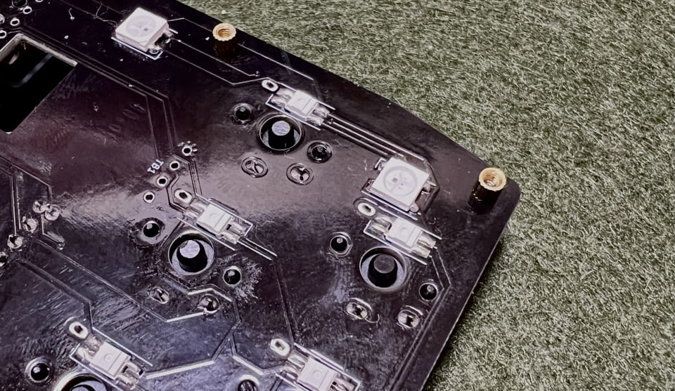
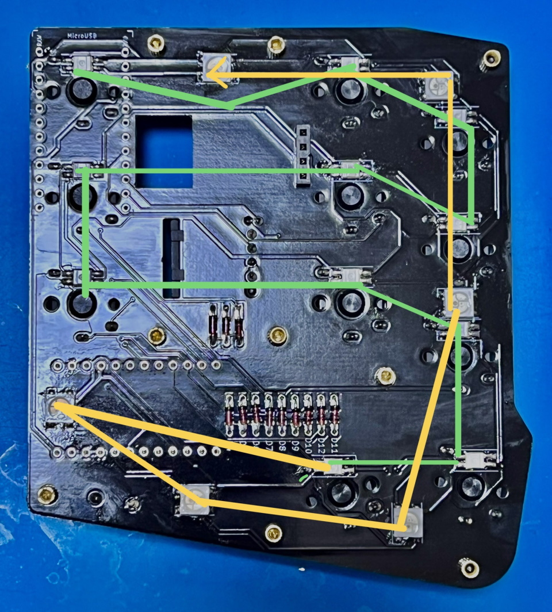
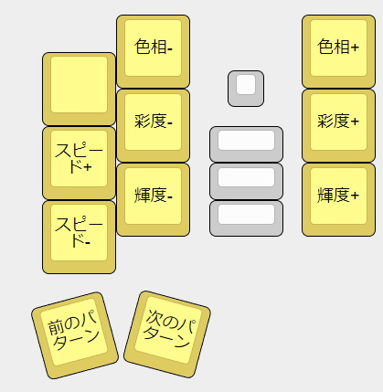

## LEDの取り付け方
端子同士がくっつきやすいので、LEDのはんだ付けにはフラックスを使います。  
はんだ付けの難易度がとても下がるため私はLED以外にも毎回使っています。  
ベタつくのでフラックスクリーナーやIPA（イソプロピルアルコール）で掃除をすると綺麗になります。  
  
LEDの切り欠きとシルク印刷のコーナーを合わせてはんだ付けしましょう。  
  
  
向きがバラバラなので毎回確認してください。  
メインボードにフラックスを塗り、こて先にのせたはんだを流し込むようにするとスムーズに付けられます。  
  
両側のランドにはんだを乗せやすいようにLEDは中央に置くことを意識するといいと思います。  

LEDは直列に配線されています。  
  
ひとつ発光しないLEDがある場合その先のLEDは正しくはんだ付けされていても光らなくなるので画像と見比べてどこが原因かを調べましょう。   

はんだ付けするだけでLEDが使えるようになります。  
ESC長押しでRGB操作用のレイヤーになります。  
  
[Keyboard Layout Editor で見る](http://www.keyboard-layout-editor.com/#/gists/8a9cd944cc1cf5abed875719608a3e3a)

ブラウザの機能で戻ってください。
